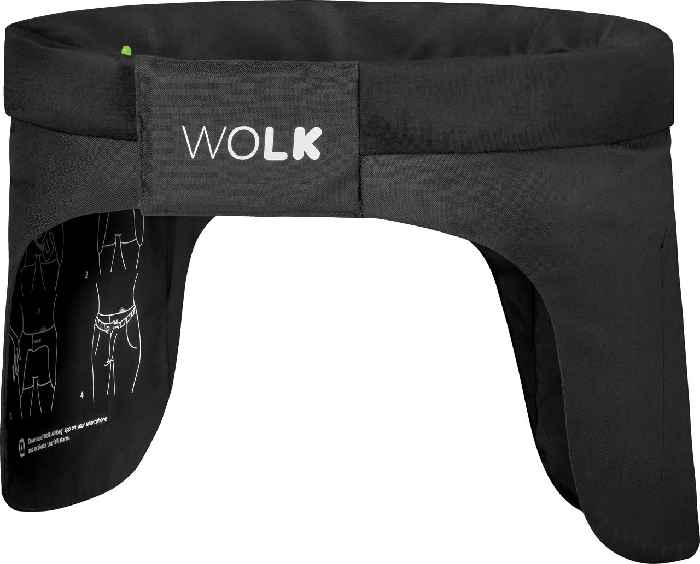
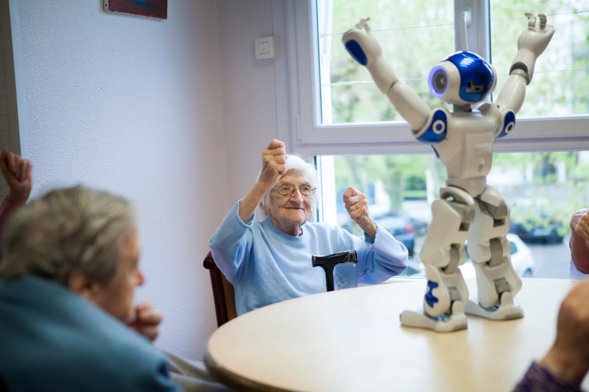

# Robotica in de zorg

## Beschermingsmiddelen

## Gezelschapsrobots

### Vereenzaming onder ouderen

In de huidige samenleving zien we een toenemende vereenzaming onder ouderen. Veel oudere mensen wonen alleen en hebben beperkte sociale interactie, wat kan leiden tot gevoelens van eenzaamheid en isolatie. Tegelijkertijd staat de zorgsector onder grote druk. Zorgverleners hebben steeds minder tijd voor sociale taken vanwege de hoge werkdruk en de noodzaak om zich te concentreren op medische en fysieke zorg.

Deze situatie creëert een groeiende behoefte aan ondersteuning door middel van robotica. Gezelschapsrobots kunnen een waardevolle rol spelen in het bieden van emotionele steun en sociale interactie voor ouderen. Deze robots kunnen gesprekken voeren, herinneringen geven aan medicatie en afspraken, en zelfs eenvoudige taken uitvoeren om het dagelijks leven van ouderen te vergemakkelijken. Door de inzet van robotica kunnen zorgverleners zich beter richten op hun kerntaken, terwijl ouderen de sociale interactie en ondersteuning krijgen die ze nodig hebben.

### Hunanoid

### Kat

<iframe width="560" height="315" src="https://www.youtube.com/embed/fmQsvgBc5Jc?si=QMwJfJSH6fQ7hGMx" title="Gezelschaps kat" frameborder="0" allow="accelerometer; autoplay; clipboard-write; encrypted-media; gyroscope; picture-in-picture; web-share" referrerpolicy="strict-origin-when-cross-origin" allowfullscreen></iframe>
